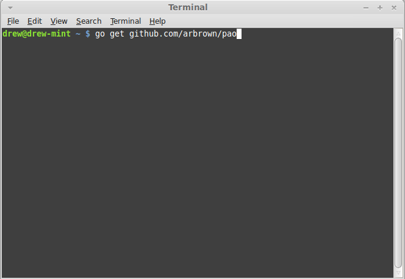
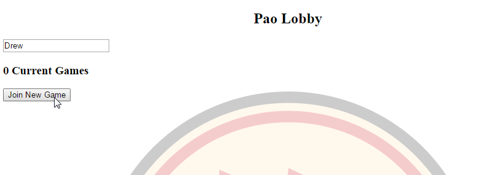
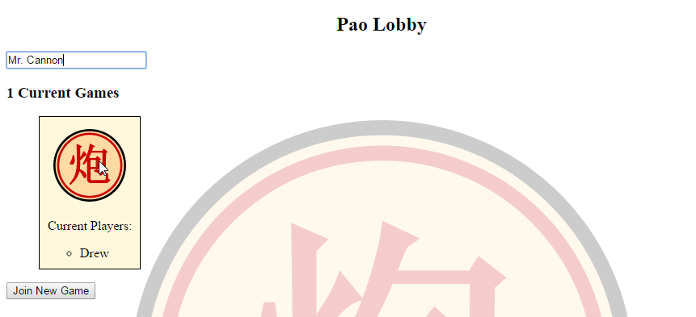
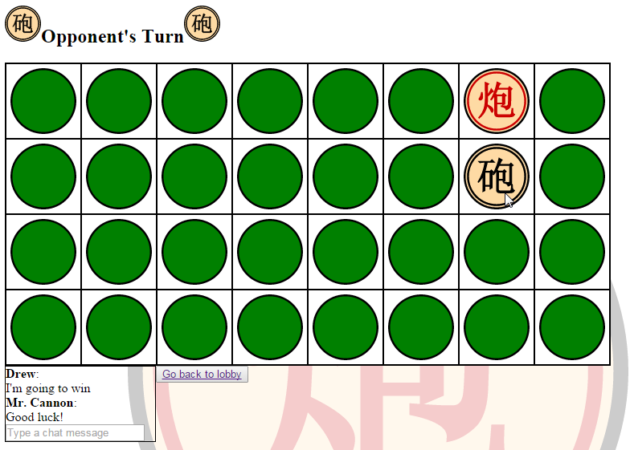

pao
===

A Ban Chi Game Server

Installing Pao
--------------
1. [Install Go](https://golang.org/doc/install) and [set up a workspace](https://golang.org/doc/code.html) - Make sure your `$GOPATH` and `$GOROOT` environment variables are set, and that the appropriate directories are added to your PATH if you want to run executables without using `go run`.
    #. This is the hardest (but probably most important) step.  Make sure to follow the instructions in the links.
2. Get the pao source:
`go get github.com/arbrown/pao`   
You can fork this repository and `go get` your own version to contribute changes upstream.
3. Go to the path where the source was installed, and run pao.go
~[go run](./screenshots/go-run.png)  
The server should begin running on port 2015.  Go to http://localhost:2015/ in a web browser to see the lobby.

Joining a game
--------------
If no games are currently running, you can join a new game by clicking the button:
  
Then, another player can join your game and it will begin.
  
Have fun!
  
Ban Chi Game Notation
---------------------
The game code uses a character-based notation to store and transmit piece information.

### Pieces
Pieces are represented by the letters in the following table

| Piece | Red | Black |
|:------|:---:|:-----:|
| King  | k   | K     |
| Guard | g   | G     |
| Elephant| e | E     |
| Cart  | c   | C     |
| Horse | h   | H     |
| Pawn  | p   | P     |
| Canon | q   | Q     |

Uncovered pieces are represented by '?' and empty squares are '.'.

### Board
The board is represented as an 8x4 (8 columns, 4 rows) board with coordinates as follows:

| .   | A | B | C | D | E | F | G | H |
|----:|:-:|:-:|:-:|:-:|:-:|:-:|:-:|:-:|
|**1**|   |   |   |   |   |   |   |   |
|**2**|   |   |   |   |   |   |   |   |
|**3**|   |   |   |   |   |   |   |   |
|**4**|   |   |   |   |   |   |   |   |

A location is referred to by its letter/number coordinates, for example, A1 or F3.

### Plies 
A ply consists of a piece identifier, a location, an action (moves '>', or becomes '=') followed by a piece identifier, and a location.  If a piece was killed in this ply, there is then an 'x' followed by the piece identifier and location of the killed piece.

For example, if a black guard at C2 killed a red pawn at D2, the ply notation would be:

    GC2>GD2xpD2

If a player turned up a red cannon at B4, the notation would be:

    ?B4=qB4
    
#### Theoretical variants
In theory, in some game variants a ply could involve more than one piece (on either side) or multiple moves (as in double-move Ban Chi.)  In this case, multiple pieces (and their locations) are separated by commas (,) and multiple moves are separated by semicolons (;).
